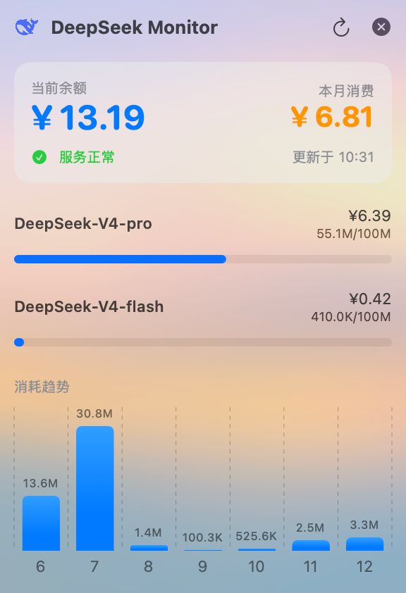

# DeepSeek Monitor

[English](README.md)

一个 macOS 菜单栏应用，实时显示 DeepSeek API 平台的余额、月度消费、各模型 Token 用量和消耗趋势。

## 功能

- 当前余额 & 本月消费
- 各模型费用拆解 + Token 消耗进度条（满值 1 亿 Token）
- 近 7 天 Token 消耗趋势柱状图
- 每小时自动刷新，也可手动刷新

## 截图



## 使用

### 1. 获取鉴权信息

打开 [DeepSeek Platform](https://platform.deepseek.com) 并登录，然后：

- **Cookie**：开发者工具 → Application → Cookies → 复制当前站点完整 Cookie
- **Token**：开发者工具 → Network → 任选一个 API 请求 → 复制 Authorization 头（Bearer xxx）

### 2. 填入凭证

编辑 `main.swift` 第 108-109 行：

```swift
private let cookie = "YOUR_COOKIE_HERE"
private let auth = "Bearer YOUR_TOKEN_HERE"
```

### 3. 构建运行

```bash
./build.sh && open DeepSeekMonitor.app
```

## 技术

- SwiftUI + Swift Charts 构建 UI
- `NSStatusBar` + `NSPopover` 实现菜单栏弹窗
- `LSUIElement = true` 隐藏 Dock 图标，纯菜单栏应用
- `DispatchGroup` 并发请求，`Timer` 定时刷新

## 许可

MIT
